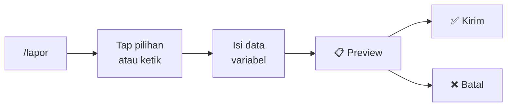
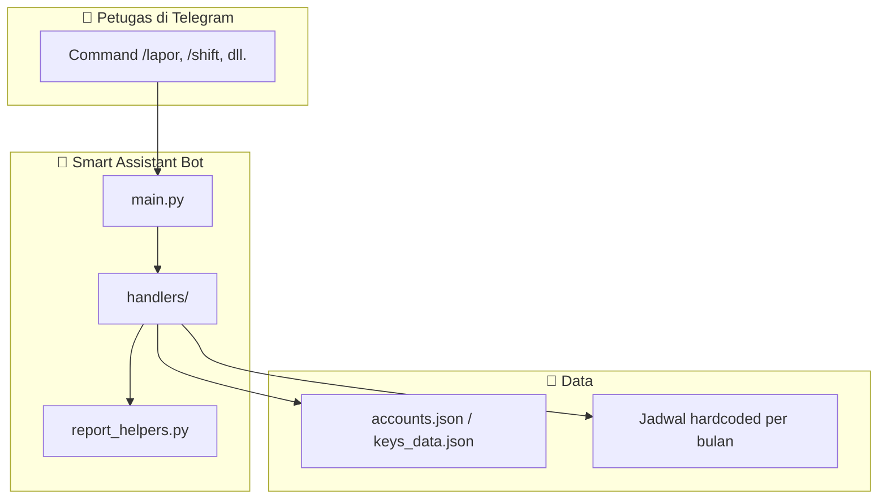

<div align="center">

  

  <h1>🚔 Smart Assistant Bot JMTO — Ruas JSM 🛣️</h1>

  <p>
    <strong>Asisten Telegram untuk pelaporan operasional tol & penjadwalan shift</strong><br>
    Dibangun khusus personil <strong>JMTO Ruas Surabaya – Mojokerto (JSM)</strong>
  </p>

  <a href="https://www.python.org/"></a>
  <a href="https://core.telegram.org/bots/api"></a>
  <a href="https://github.com/python-telegram-bot/python-telegram-bot"></a>
  <a href="https://github.com/premdwt/bot-JMTO-telegram"></a>

  <br><br>

  <a href="#-fitur-utama">Fitur</a> •
  <a href="#-cara-pakai-laporan">Cara Pakai</a> •
  <a href="#-instalasi">Instalasi</a> •
  <a href="#-struktur-project">Struktur</a> •
  <a href="#-roadmap">Roadmap</a>

</div>

---

## 🌟 Tentang Bot Ini

Bot ini dibuat untuk **mempercepat pekerjaan operasional di lapangan**. Alih-alih mengetik format laporan panjang secara manual (rawan typo & boros waktu), petugas cukup menjawab pertanyaan bot — lalu bot menyusun laporan standar yang rapi dalam hitungan detik.

Selain pelaporan, bot juga dilengkapi **sistem jadwal shift** petugas Unit 211/212 dan MCSS, plus modul **VIP Generator** untuk distribusi akun premium.

### Kenapa pakai bot ini?

| Masalah di lapangan | Solusi dari bot |
|---------------------|-----------------|
| Format laporan harus diingat | Bot susun otomatis sesuai standar |
| Sering salah ketik saat buru-buru | Tombol tap + validasi input |
| Takut kirim laporan salah | **Preview dulu** sebelum dikirim |
| Cek jadwal harus buka Excel | `/jadwal` & `/shift` langsung di HP |
| Oddo harus dihitung manual | Bot hitung `Oddo Akhir − Oddo Awal` otomatis |

---

## ✨ Fitur Utama

### 🎯 Smart UX Lapangan *(baru)*

Semua command laporan (`/lapor`, `/laka`, `/pantauan`, `/trace`, `/giat`) sudah dilengkapi:

- **Inline Keyboard** — tap pilihan umum (JSM 211/212, shift, cuaca, kendala, dll.)
- **Input manual tetap bisa** — kalau kondisinya spesial, ketik saja
- **Preview sebelum kirim** — cek laporan dulu, baru konfirmasi
- **Validasi cerdas** — oddo harus angka, peringatan kalau oddo akhir < awal
- **Waktu WIB otomatis** — tanggal & ucapan waktu (pagi/siang/sore/malam) akurat



---

## 📝 Menu Laporan Operasional

### `/lapor` — Laporan Serah Terima Shift

Laporan serah terima awal/akhir tugas dengan perhitungan Oddo otomatis.

| Fitur | Detail |
|-------|--------|
| Tombol cepat | JSM 211/212, Shift 1/2/3, Semua Baik |
| Hitung Oddo | `Oddo Akhir = 0` → laporan **awal tugas** |
| Validasi | Oddo wajib angka, konfirmasi jika oddo terbalik |
| Langkah | 10 step → preview → kirim |

**Contoh output:**
```
Mohon ijin melaporkan serah terima akhir tugas :

🚔 JSM 211
📆 Senin , 15 Juni 2026
🕕 Shift 2
Personil :
▪️Ade
▪️Amirul
...
Jumlah Oddo : 70
```

---

### `/laka` — Laporan Awal Kejadian 33

Laporan cepat tanggap untuk kejadian laka di ruas tol.

| Tombol cepat | M / L / K, Shift, Penyebab, Korban, Cuaca, Info Ban Nihil |
|--------------|----------------------------------------------------------|
| Data ban | Format: `Umur, Tekanan, Kondisi, Penyebab, Jenis` atau tap **Nihil** |
| Output | Format standar Laporan Awal Kejadian ruas SUMO |

---

### `/pantauan` — Laporan Pantauan Kondisi

Laporan situasi & kondisi terkini di ruas.

| Tombol cepat | Kendaraan, Cuaca, Lalin, Giat |
|--------------|-------------------------------|
| Otomatis | Ucapan waktu (Pagi/Siang/Sore/Malam) berdasarkan jam WIB |
| Field | 10.2 Posisi, 8.1.5 Cuaca, 8.1.9 Lalin, Oddo, Giat |

---

### `/trace` — Laporan Penanganan Kendala

Laporan penanganan kendala kendaraan pengguna jalan (pecah ban, overheat, dll.)

| Tombol cepat | Unit, Shift, Kendala, Tindak Lanjut |
|--------------|-------------------------------------|
| Output | Format LAPORAN MCS RUAS SUMO + blok Tindak Lanjut |
| Markdown | Auto-escape karakter khusus agar tidak error di Telegram |

---

### `/giat` — Laporan Penanganan Biasa / Rutin

Untuk kegiatan patroli, standby, atau penanganan rutin.

| Tombol cepat | Unit, Jenis Giat (Patroli / Standby / Pembersihan) |
|--------------|-----------------------------------------------------|

---

## 📅 Menu Jadwal Shift

> 📌 Database jadwal saat ini: **Juni 2026** (Unit 211, 212 & MCSS)

| Command | Fungsi | Cara pakai |
|---------|--------|------------|
| `/jadwal` | Jadwal 1 bulan per petugas | Ketik nama (contoh: `Enggar`) |
| `/shift` | Petugas harian per tanggal | Ketik tanggal 1–30 |
| `/210` | Jadwal 1 bulan per MCSS/Kashift | Ketik nama MCSS |
| `/210s` | Shift MCSS harian | Ketik tanggal 1–30 |

**Fitur khusus MCSS:** logika pengganti cuti otomatis — kalau ada yang cuti, bot tampilkan siapa penggantinya termasuk double shift.

---

## 🎁 VIP Generator Premium

Modul terpisah untuk sistem lisensi & distribusi akun streaming.

### Untuk User

| Command | Fungsi |
|---------|--------|
| `/redeem <key>` | Aktivasi license key VIP |
| `/generate hbo` | Ambil akun HBO (via DM) |
| `/generate vision` | Ambil akun Vision+ (via DM) |

### Untuk Admin

| Command | Fungsi |
|---------|--------|
| `/genkey <durasi>` | Buat key baru |
| `/checkkey <key>` | Cek status key |
| `/deletekey <key>` | Hapus key & cabut akses user |
| `/cleankey` | Bersihkan key & user expired |

**Durasi key yang tersedia:**

| Kode | Durasi |
|------|--------|
| `30m` | 30 Menit |
| `1h` | 1 Jam |
| `12h` | 12 Jam |
| `1d` | 1 Hari |
| `1w` | 1 Minggu |
| `1mo` | 1 Bulan |

**Contoh:** `/genkey 1d` → hasilkan key `PREM-XXXXXXXX`

---

## 🎮 Cara Pakai Laporan

### Mulai

1. Buka bot di Telegram
2. Ketik `/start` untuk melihat menu lengkap
3. Pilih command laporan yang dibutuhkan

### Selama mengisi

- **Tap tombol** untuk pilihan yang sudah tersedia
- **Ketik manual** jika kondisi di lapangan tidak ada di tombol
- Ketik **`/cancel`** kapan saja untuk membatalkan

### Sebelum kirim

Bot akan menampilkan **preview lengkap**. Pastikan data sudah benar, lalu tap:

- ✅ **Kirim Laporan** — laporan final dikirim
- ❌ **Batal** — proses dibatalkan

---

## ⚙️ Instalasi

### Persyaratan

- Python **3.8+**
- Library [`python-telegram-bot`](https://github.com/python-telegram-bot/python-telegram-bot) **v20+**
- **Bot Token** dari [@BotFather](https://t.me/BotFather)
- Telegram User ID admin (cek via [@userinfobot](https://t.me/userinfobot))

### 1. Clone repository

```bash
git clone https://github.com/premdwt/bot-JMTO-telegram.git
cd bot-JMTO-telegram
```

### 2. Install dependency

```bash
pip install "python-telegram-bot>=20.0"
```

### 3. Konfigurasi

Buat file `config.py` di root project:

```python
BOT_TOKEN = "MASUKKAN_TOKEN_DARI_BOTFATHER"
ADMIN_ID = 123456789  # Telegram User ID admin
```

> ⚠️ `config.py` sudah masuk `.gitignore` — jangan commit token ke repository.

### 4. Siapkan data generator *(opsional)*

Jika menggunakan fitur VIP Generator:

```bash
# Buat file accounts.json
{
  "hbo": ["email:password"],
  "vision": ["email:password"]
}

# keys_data.json akan dibuat otomatis saat /genkey pertama kali
```

### 5. Jalankan bot

```bash
python main.py
```

Output terminal yang normal:

```
Membangunkan bot...
Bot berhasil nyala! Tekan Ctrl+C untuk mematikan.
```

---

## 📁 Struktur Project

```
bot-JMTO-telegram/
├── main.py                  # Entry point & registrasi handler
├── config.py                # Token bot & Admin ID (gitignored)
├── accounts.json            # Stok akun VIP (hbo/vision)
├── keys_data.json           # Database license key & user VIP
│
└── handlers/
    ├── base_cmds.py         # /start — menu utama
    ├── report_helpers.py    # Modul bersama: tombol, preview, WIB, dll.
    │
    ├── lapor_cmd.py         # /lapor — serah terima shift
    ├── laka_cmd.py          # /laka — laporan kejadian 33
    ├── pantauan_cmd.py      # /pantauan — pantauan kondisi
    ├── trace_cmd.py         # /trace — penanganan kendala
    ├── giat_cmd.py          # /giat — kegiatan rutin
    │
    ├── jadwal_cmd.py        # /jadwal & /shift — petugas lapangan
    ├── jadwal_mcss_cmd.py   # /210 & /210s — jadwal MCSS
    └── generator_cmd.py     # Sistem VIP key & akun premium
```

### Arsitektur singkat



---

## 💡 Tips Penggunaan

| Situasi | Saran |
|---------|-------|
| Laporan awal tugas | Ketik `0` di Oddo Akhir |
| Kondisi kendaraan normal | Tap **Semua Baik** di `/lapor` |
| Tidak ada info ban di `/laka` | Tap **Nihil** |
| Akun VIP tidak masuk DM | Pastikan sudah `/start` bot secara pribadi |
| Salah isi di tengah jalan | Ketik `/cancel` lalu mulai ulang |

---

## 🗺️ Roadmap

Fitur yang direncanakan untuk pengembangan selanjutnya:

- [ ] **Template Personil** — simpan unit & nama personil favorit, pakai ulang tiap shift
- [ ] **Integrasi AI** — input natural language, bot parse jadi format laporan
- [ ] **Jadwal dinamis** — upload jadwal bulan baru tanpa edit kode
- [ ] **Tracking stok VIP** — log distribusi akun per user

---

## 👨‍💻 Developer

Dikembangkan oleh **Enggarjaya Premana** — personil JMTO Ruas JSM.

Bot ini dibuat dari kebutuhan nyata di lapangan: **cepat, rapi, minim typo, dan cocok dipakai dari HP saat bertugas.**

---

<div align="center">

  **Selamat Bertugas — Utamakan Keselamatan, Aman TKA!** 🤲🏻🚔

  <br><br>

  <sub>Dibuat dengan ☕ dan Python untuk JMTO Ruas Surabaya – Mojokerto</sub>

</div>